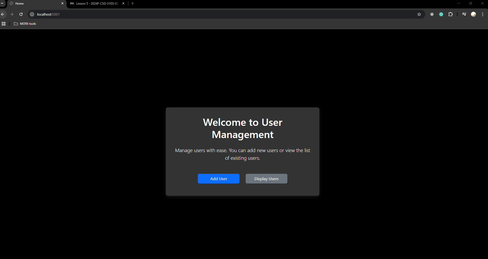
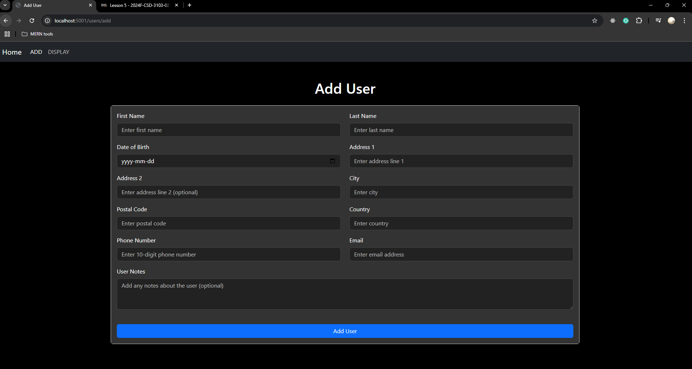
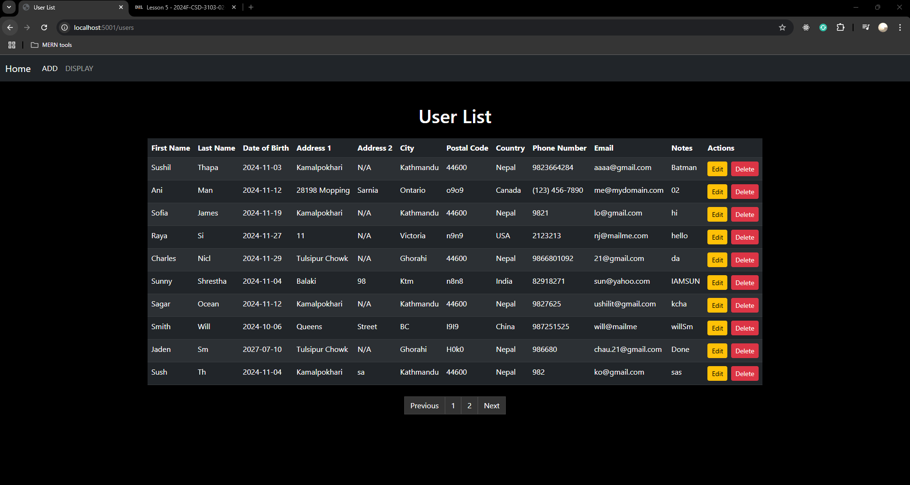

# CSD-3103-02
The code base of the course 2024F-CSD-3103-02-Full Stack JavaScript.

# E-Commerce Flask Application

This is a simple CRUD application for user management using Node.js with Express, Mongoose and MongoDB.

## Features

### Manages following data:
- First Name
- Last Name
- Date of Birth
- Address1
- Address2
- City
- Postal Code
- Country
- Phone Number
- Email
- User Notes
- Pagination

## Application Preview

Homepage

Add Page

View Page


## Setup
1. Clone the repository:
   ```
   git clone https://github.com/sushilthapaIT/User-CRUD-App.git
   cd "Project Folder"
   ```

2. Install Node.js and npm:
   ```
    node install
    npm install
   ```

3. Install Project Dependencies:
   ```
   npm install
   ```

4. Set up your MongoDB Atlas database and update the `.env` file with your connection string.

##### Set Up Instructions
To run the application, you have to create a ".env" file locally.
This file must include two variables called ```"MONGODB_USERNAME"``` and ```"MONGODB_PASSWORD"```,
which can be MongoDB Atlas credentials. 

5. Run the Application:
   ```
   npm start
   npm run dev
   ```

6. Access the Application
  Open your web browser and go to http://localhost:5000 (or the port you set in .env). You should see the home page of the application